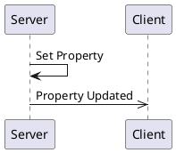

# _Property Only Interface_ API Overview 

<!--
This is automatically generated documentation.
LICENSE: This generated content is not subject to any license restrictions.
TODO: Get license text from stinger file
--> 
_Example StingerAPI interface which only has properties, plus a struct and an enum._


[[_TOC_]]

## Connections

A connection object is a wrapper around an MQTT client and provides specific functionality to support both clients and servers.
Generally, you only need one connection object per daemon/program, as it can support multiple clients and servers.  
For most languages, Stinger-IPC does not require a specific connection object implementation, as long as it implements the required interface.

The application code is responsible for creating and managing the connection object, including connecting to the MQTT broker.

### Connection code Examples

<details>
  <summary>Python MQTT Connection Example</summary>

Rather than including connection code in each generated client and server, Stinger-IPC for Python uses the [PYQTtier](https://pypi.org/project/pyqttier/) library to provide MQTT connection objects.  PYQTtier is a wrapper around the [paho-mqtt](https://pypi.org/project/paho-mqtt/) library and handles serialization, message queuing, and acknowledgments.

```python
from pyqttier import Mqtt5Connection, MqttTransportType, MqttTransport

transport = MqttTransport(MqttTransportType.TCP, "localhost", 1883) # Or: MqttTransport(MqttTransportType.UNIX, socket_path="/path/to/socket")
connection_object = Mqtt5Connection(transport)
```

The `connection_object` will be passed to client and server constructors.

</details>

<details>
  <summary>Rust MQTT Connection Example</summary>

Stinger-IPC instances only require an MQTT connection object that implements the [`stinger_mqtt_trait::Mqtt5PubSub` trait](https://docs.rs/stinger-mqtt-trait/latest/stinger_mqtt_trait/trait.Mqtt5PubSub.html). 

The [MQTTier](https://crates.io/crates/mqttier) crate provides an implementation of the `Mqtt5PubSub` trait, and is shown in this documentation as an example.  MQTTier is a wrapper around the [rumqttc](https://crates.io/crates/rumqttc) crate and handles serialization, message queuing, and acknowledgments.'

Here is an example showing how to create an MQTTier client connection object:

```rust
use mqttier::{MqttierClient, MqttierOptionsBuilder, Connection};

let mqttier_options = MqttierOptionsBuilder::default()
    .connection(Connection::TcpLocalhost(1883))
    .client_id("rust-client-demo".to_string())
    .build().unwrap();
let mut connection_object = MqttierClient::new(mqttier_options).unwrap();
let _ = connection_object.start().await;
```

The `connection_object` will be passed to client and server constructors.

</details>

<details>
  <summary>C++ MQTT Connection Example</summary>

The C++ connection object is a wrapper around the [libmosquitto](https://mosquitto.org/api/files/mosquitto-h.html) C library.  This library only supports TCP and WebSocket connections.  Unix Domain Socket support may be added in the future.

```c++
#include "broker.hpp"

auto connection_object = std::make_shared<MqttBrokerConnection>("localhost", 1883, "daemon-name");
```

The `connection_object` will be passed to client and server constructors.

</details>

## Discovery

Because there may be multiple instances of the same Stinger Interface, a discovery mechanism is provided to find and connect to them.  A discovery class is provided which connects to
the MQTT broker and listens for Stinger Interface announcements.  The discovery class can then provide PropOnlyClient client instances.  Additionally, the discovery class
find all the current property values for discovered interfaces in order to initialize the client instance.

### Discovery Code Examples

<details>
  <summary>Python Discovery Example</summary>

```python
from proponlyipc.client import PropOnlyClientDiscoverer

discovery = PropOnlyClientDiscoverer(connection_object)

# To get a single client instance (waits until one is found):
client = discovery.get_singleton_client().result()

# To get all currently available client instances (does not wait):
discovered_service_ids = discovery.get_service_instance_ids()
clients = [discovery.get_client_for_instance(service_id) for service_id in discovered_service_ids]
```
</details>

<details>
  <summary>Rust Discovery Example</summary>

```rust
use prop_only_ipc::discovery::PropOnlyDiscovery;

let discovered_singleton_info = {
    let service_discovery = PropOnlyDiscovery::new(&mut connection_object).await.unwrap();
    service_discovery.get_singleton_instance_info().await // Blocks until a service is discovered.
}
let prop_only_client = PropOnlyClient::new(&mut connection_object, &discovered_singleton_info).await;
```

</details>

## Server

A server is a _provider_ of functionality.  It and owns property values.

When constructing a server instance, a connection object and initial property values must be provided.

### Server Code Examples

<details>
  <summary>Python Server Object Construction</summary>

Because the server needs correct property values on initialization, a PropOnlyInitialPropertyValues object must be provided to
the server constructor.


```python
from proponlyipc.server import PropOnlyServer
from proponlyipc.property import PropOnlyInitialPropertyValues

# Ideally, you would load these initial property values from a configuration file or database.

initial_property_values = PropOnlyInitialPropertyValues(

    home_address=Address(street="apples", city="apples", state="apples", postal_code="apples", country=Country.USA),
        
    home_address_version=1,

    favorite_country=Country.USA,
        
    favorite_country_version=2,

)


service_id = "py-server-demo:1" # Can be anything. When there is a single instance of the interface, 'singleton' is often used.
server = PropOnlyServer(connection_object, service_id, initial_property_values)
```


The `server` object provides methods for emitting signals and updating properties.  It also allows for decorators to indicate method call handlers.

A full example can be viewed by looking at the `example/server_demo.py` file of the generated code.

When decorating class methods, especially when there might be multiple instances of the class with methods being decorated, the Python implementation provides a `PropOnlyClientBuilder`
class to help capture decorated methods and bind them to a specific instance at runtime. Here is an example of how to use it in a class:

```python
from proponlyipc.client import PropOnlyClientBuilder

prop_only_builder = PropOnlyClientBuilder()

class MyClass:
    def __init__(self, label: str, connection: MqttBrokerConnection):
        instance_info = ... # Create manually or use discovery to get this
        self.client = prop_only_builder.build(connection_object, instance_info, binding=self) # The binding param binds all decorated methods to the `self` instance.

    @prop_only_builder.receive_a_signal
    def on_a_signal(self, param1: int, param2: str):
        ...
```

A more complete example, including use with the discovery mechanism, can be viewed by looking at the generated `examples/server_demo_classes.py` file.

</details>

<details>
  <summary>Rust Server Struct Creation</summary>

Service code for Rust is only available when using the `server` feature:

```sh
cargo add prop_only_ipc --features=server
```

Here is an example of how to create a server instance:

```rust
use prop_only_ipc::server::PropOnlyServer;
use prop_only_ipc::property::PropOnlyInitialPropertyValues;

let service_id = String::from("rust-server-demo:1");

let initial_property_values = PropOnlyInitialPropertyValues {
    
    home_address:Address {street: "apples".to_string(), city: "apples".to_string(), state: "apples".to_string(), postal_code: "apples".to_string(), country: Country::Usa},
    home_address_version: 1,
    
    favorite_country:Country::Usa,
    favorite_country_version: 1,
    
};


// Create the server object.
let mut server = PropOnlyServer::new(connection_object, serivce_id initial_property_values, ).await;


```

Providing method handlers is better described in the [Methods](#methods) section.  

A full example can be viewed by looking at the generated `examples/server_demo.rs` example and can be compiled with `cargo run --example prop_only_server_demo --features=server` in the generated Rust project.

</details>

<details>
  <summary>C++ Server Object Construction</summary>

```c++
// To be written
```

The `server` object provides methods for emitting signals and updating properties.  It also allows for decorators to indicate method call handlers.

A full example can be viewed by looking at the generated `examples/server_main.cpp` file.`

</details>

## Client

A client is a _utilizer_ of functionality.  It receives signals, makes method calls, reads property values, or requests updates to property values.

<details>
  <summary>Rust Client Struct Creation</summary>

The best way to create a client instance is to use the discovery class to find an instance of the service, and then create the client from the discovered instance information.
An example of that is shown in the [Discovery](#discovery) section.  However, if you already know the service instance IDand initial property values, you can create a client directly:

```rust
use prop_only_ipc::client::PropOnlyClient;

let instance_info = DiscoveredInstance {
    service_instance_id: String::from("singleton"),
    
    initial_property_values: PropOnlyInitialPropertyValues {
        
        home_address:Address {street: "apples".to_string(), city: "apples".to_string(), state: "apples".to_string(), postal_code: "apples".to_string(), country: Country::Usa},
        home_address_version: 1,
        
        favorite_country:Country::Usa,
        favorite_country_version: 1,
        
    },
    
};

let prop_only_client = PropOnlyClient::new(connection_object.clone(), instance_info).await;
```

A full example can be viewed by looking at the generated `client/examples/client_demo.rs` file.

</details>

<details>
  <summary>Python Client Object Construction</summary>

Because the client needs correct property values on initialization, a PropOnlyInitialPropertyValues object must be provided to
the client constructor.  This object is generally created by the discovery mechanism.

```python
from proponlyipc.server import PropOnlyServer, PropOnlyInitialPropertyValues


initial_property_values = PropOnlyInitialPropertyValues(

    home_address=Address(street="apples", city="apples", state="apples", postal_code="apples", country=Country.USA),
        
    home_address_version=1,

    favorite_country=Country.USA,
        
    favorite_country_version=2,

)


service_instance_id="singleton"
server = PropOnlyServer(connection_object, service_instance_id, initial_property_values)
```

A full example can be viewed by looking at the generated `examples/client_main.py` file.

Like the Python client, there is a `PropOnlyServerBuilder` class to help capture decorated methods and bind them to a specific instance at runtime.

```python

</details>

<details>
  <summary>C++ Client Object Construction</summary>

A full example can be viewed by looking at the generated `examples/client_main.cpp` file.

</details>

## Logging

Each generated language has different ways of handling logging.  

### Python

Python uses the standard Python `logging` module.  

### Rust

Rust uses the `tracing` crate for logging.

### C++

C++ uses a user-provided logging function.  The function should take two parameters: an integer log level and a string message. 

Log levels are re-used from the `syslog.h` header file, although no other syslog mechanisms are used.  Client and server classes use the logging provided by the `MqttBrokerConnection` object.

<details>
  <summary>Example C++ Log Setup</summary>

```c++
#include <syslog.h>

auto connection = std::make_shared<MqttBrokerConnection>(...);
connection->SetLogLevel(LOG_DEBUG);
connection->SetLogFunction([](int level, const char* msg)
{
    std::cout << "[" << level << "] " << msg << std::endl;
});
```

</details>


## Properties

Properties are values (or a set of values) held by the server.   They are re-published when the value changes. 



### Property `home_address`

The current home address.

| Name          | Type     |Description|
|---------------|----------|-----------|
|    address    |[Struct Address](#enum-Address)||

### Code Examples

<details>
  <summary>Rust Server code for reading and writing the 'home_address' property</summary>

A server hold the "source of truth" for the value of `home_address`.  An `Arc` pointer can be copied and moved that points to the server's property value.   Here is how to write a new value:

```rust
let home_address_handle = server.get_home_address_handle();
{
    let mut home_address_guard = home_address_handle.write().await;
    *home_address_guard = Address {street: "foo".to_string(), city: "foo".to_string(), state: "foo".to_string(), postal_code: "foo".to_string(), country: Country::Usa};
    // Optional, block until the property is published to the MQTT broker:
    home_address_guard.commit(std::time::Duration::from_secs(2)).await;

    // If not committed, the property will be published when the guard is dropped in "fire-and-forget" mode.
}

```

If only reading the value, a read guard can be used:

```rust
let home_address_guard = home_address_handle.read().await;
```

Application code can subscribe to property updates by subscribing to a `tokio::sync::watch` channel which can be obtained by:

```rust
let home_address_watch_rx = client.watch_home_address();

if home_address_watch_rx.changed().await.is_ok() {
    let latest = home_address_watch_rx.borrow().clone();
    println!("Property updated: {:?}", latest);
}
```
</details>

<details>
  <summary>Rust Client code for reading and writing  the 'home_address' property</summary>

  A Rust client works with properties the same was as the server.  
  When using the `commit()` method on the write guard, the client will send a request to the server to update the property value and block until the server acknowledges the update.
  

</details>


### Property `favorite_country`

The user's favorite country.

| Name          | Type     |Description|
|---------------|----------|-----------|
|    country    |[Enum Country](#enum-Country)||

### Code Examples

<details>
  <summary>Rust Server code for reading and writing the 'favorite_country' property</summary>

A server hold the "source of truth" for the value of `favorite_country`.  An `Arc` pointer can be copied and moved that points to the server's property value.   Here is how to write a new value:

```rust
let favorite_country_handle = server.get_favorite_country_handle();
{
    let mut favorite_country_guard = favorite_country_handle.write().await;
    *favorite_country_guard = Country::Usa;
    // Optional, block until the property is published to the MQTT broker:
    favorite_country_guard.commit(std::time::Duration::from_secs(2)).await;

    // If not committed, the property will be published when the guard is dropped in "fire-and-forget" mode.
}

```

If only reading the value, a read guard can be used:

```rust
let favorite_country_guard = favorite_country_handle.read().await;
```

Application code can subscribe to property updates by subscribing to a `tokio::sync::watch` channel which can be obtained by:

```rust
let favorite_country_watch_rx = client.watch_favorite_country();

if favorite_country_watch_rx.changed().await.is_ok() {
    let latest = favorite_country_watch_rx.borrow().clone();
    println!("Property updated: {:?}", latest);
}
```
</details>

<details>
  <summary>Rust Client code for reading and writing  the 'favorite_country' property</summary>

  A Rust client works with properties the same was as the server.  
  When using the `commit()` method on the write guard, the client will send a request to the server to update the property value and block until the server acknowledges the update.
  

</details>


## Enums


### Enum `Country`

<a name="Enum-Country"></a>A small set of supported countries.

* USA (1) - United States of America.
* Canada (2)
* Mexico (3)


## Structures

Structures are a group of values and may be used as an argument in signals, methods, or properties.  Defining a structure allows for easy reuse.

### Struct `Address`

<a name="Struct-Address"></a>_No general description exists for this structure_

| Name          | Type     |Description|
|---------------|----------|-----------|
|     street    |  string  |The street address.|
|      city     |  string  |The city name.|
|     state     |  string  |The state or province.|
|  postal_code  |  string  |The postal or ZIP code.|
|    country    |[Enum Country](#enum-Country)||
